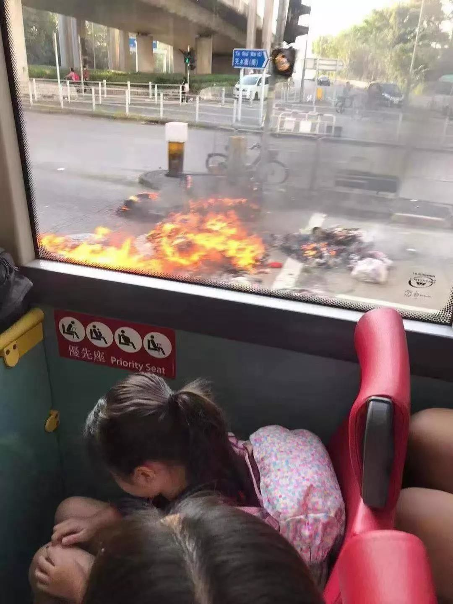
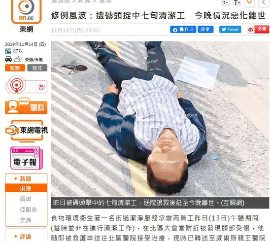

---
output:
    rmarkdown::html_document:
        number_sections: true
        toc: true
---

# random-violence

## 191113-楼梯上踢市民

[click to view video](../random-violence/191113-楼梯上踢市民/191113-楼梯上踢市民0.mp4)

## 0-校车

## 殴打合集

## 191112-殴打日本游客

观察者网
https://www.guancha.cn/internation/2019_11_12_524938.shtml

日本时事社11月12日消息，日本外务大臣茂木敏充在当天的记者会上确认，一名50余岁的日本籍男子11日在香港抗议示威活动中负伤。男子随后被送往医院治疗，已经出院。

稍早前，在今天上午举行的政府例行记者会上，第一个问题就是关于此事。内阁官房长官菅义伟当时在回答共同社提问时表示，已了解相关报道，日本总领馆正在就男子国籍在内的相关事实进行确认。
昨天傍晚，香港《星岛日报》称，大批暴徒下午在旺角弥敦道及亚皆老街交界堵路。期间一名日本游客途经拍照片，被误会为内地人，最后被暴徒“私了”，头部受伤流血，在场有穿反光衣的急救员为他治理伤势。消息传出后，《产经新闻》、共同社及英语的NHK国际引述香港媒体进行了报道。

## 191113-0-70岁清洁工被打死

据多家港媒刚刚消息，13日被暴徒扔砖击中头部的七旬老人14日晚22时51分证实不治，案件将会转交死因裁判官跟进。香港警方刚刚向环球时报-环球网记者确认，14日22：51分，13日在上水被砖块击中头部的70岁老人不幸去世。

# vandalism-and-police-actions

## 0-地铁放火

[click to view video](../vandalism-and-police-actions/0-地铁放火/0-地铁放火1.mp4)

# hk-universities

## 城大警铃继续上课

[click to view video](../hk-universities/城大警铃继续上课/城大警铃继续上课0.mp4)

## 191112-0-投石器

[click to view video](../hk-universities/191112-0-投石器/191112-0-投石器1.mp4)

# media

## 191108-德国之音

[click to view video](../media/191108-德国之音/191108-德国之音1.mp4)

# oxford

## 191113-5th-Week-MT19-Student-Council-Agenda

# misc

## 英国发布的香港半年报告

